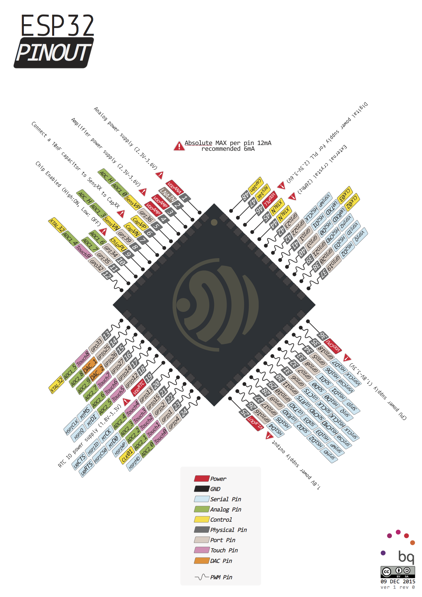
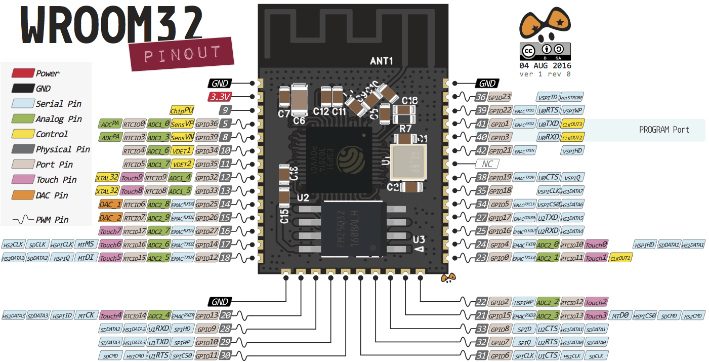

# foss-workshop

## Hardware

## Usage
1. Download and install Arduino:
  <https://www.arduino.cc/en/Main/Software>

2. Add this to your boards:
   < https://dl.espressif.com/dl/package_esp32_dev_index.json >
   
    (more instructions:
<https://github.com/espressif/arduino-esp32/blob/master/docs/arduino-ide/boards_manager.md>)

3. Install USB to UART Driver:
   <https://www.silabs.com/products/development-tools/software/usb-to-uart-bridge-vcp-drivers>

5. 4. Install T-Watch library
   <https://github.com/Xinyuan-LilyGO/TTGO_TWatch_Library>.
6. For Web serial visualixation:
   https://tejaswigowda.com/webserial-imu-debug/   